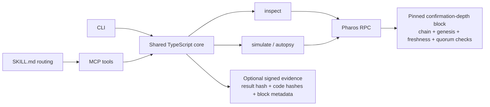

# Pharos Shield

Pharos Phase 2 agents will sign transactions autonomously, so they need a
fact-based gate between intent and signature. **Pharos Shield is the pre-flight
gate every agent can call before signing, and the forensics tool it can call
when a transaction fails.** It inspects contract controls, simulates the exact
call, and reports verified Pharos mainnet facts without SAFE/UNSAFE verdicts,
risk scores, mock data, or fabricated decoding.

---

## One command before signing: `guard`

`guard` composes target inspection and exact-call simulation into one report:
contract or EOA, proxy implementation/admin, notable opcodes, call tree,
decoded revert, approval intents, native value intents, and stable fact flags.

```bash
npm run cli -- guard \
  --from 0x7Ac6d25FD5E437cB7c57Aee77aC2d0A6Cb85936C \
  --to   0x52c48d4213107b20bc583832b0d951fb9ca8f0b0 \
  --data 0x095ea7b3000000000000000000000000bf105f4fd2f8f4c91d9a84a8d9708d23d8773f6effffffffffffffffffffffffffffffffffffffffffffffffffffffffffffffff
```

Observed on Pharos mainnet:

```text
Simulation outcome: would succeed
approve(address,uint256): isUnlimited=true
Flags (facts that warrant attention)
  unlimited_approval: The calldata requests an unlimited approval.
Exit code: 2
```

Exit `0` means the check completed with no flags, `2` means verified fact flags
were returned, and `1` means Shield itself could not complete. These are
machine gates for agents, not safety verdicts.

---

## For judges — 90-second path

Run from `pharos-shield/pharos-shield` after installation:

```bash
# 1. Prove network identity and trace support.
npm run cli -- probe
# -> chain 1672; traceCall=true; traceTransaction=true

# 2. Explain a real failed mainnet transaction.
npm run cli -- autopsy 0xdeeb262fad28864a8e031db91e99de0bb4bd42aff936876d577adcddcf0de3ff
# -> status=failed; decoded revert="BC"

# 3. Map a real EIP-1967 proxy and its control endpoint.
npm run cli -- inspect 0x3c2269811836af69497e5f486a85d7316753cf62
# -> implementation=0x4EE2...5245; admin=0x9740...d9E4

# 4. Put the max-approval request through the pre-sign gate.
npm run cli -- guard \
  --from 0x7Ac6d25FD5E437cB7c57Aee77aC2d0A6Cb85936C \
  --to 0x52c48d4213107b20bc583832b0d951fb9ca8f0b0 \
  --data 0x095ea7b3000000000000000000000000bf105f4fd2f8f4c91d9a84a8d9708d23d8773f6effffffffffffffffffffffffffffffffffffffffffffffffffffffffffffffff
# -> unlimited_approval; exit 2
```

Every expected result above was reproduced against Pharos mainnet during the
pre-submission verification.

---

## Architecture



The CLI and MCP server are thin adapters over the same core. Signed evidence is
opt-in and uses only a separate `PHAROS_EVIDENCE_SIGNING_KEY`.

---

## Install (one step — or just tell your agent)

You do not need to run anything by hand. In Claude Code or another agent CLI
with a shell, say:

> **"Install this skill: https://github.com/Jennycruzy/pharos-shield"**

The agent clones the repo and runs:

```bash
git clone https://github.com/Jennycruzy/pharos-shield
cd pharos-shield
bash install.sh
```

`install.sh` is idempotent and:

1. `npm install` in `pharos-shield/` (this also compiles `dist/`).
2. Registers the MCP server with Claude Code (user scope) — your
   natural-language interface (`shield_guard/inspect/autopsy/simulate/probe`).
3. Installs the agent skill into `~/.claude/skills/pharos-shield`.

Open a **new** session (MCP tools load at startup), then just ask:
*"is `0x3c22…cf62` a proxy and who can upgrade it?"* — the agent calls the right
tool and answers with on-chain facts. Other CLIs: `cd pharos-shield && npm run setup`
prints ready-to-paste config. Full details in
[Using Shield from an AI agent (MCP)](#using-shield-from-an-ai-agent-mcp).

---

## Full documentation

**Scope.** Pharos Shield is a transaction-and-contract integrity layer with four
composable commands: `guard`, `simulate`, `autopsy`, and `inspect`. It answers:

> *Will this transaction do what I expect, or why did it fail?*
>
> *What is this contract, and who controls it?*

It operates at the **transaction-execution and contract-control layer**. It is
**not** a token rug/honeypot/tax scanner. Shield verifies what a transaction
does and what a contract is from on-chain facts only.

> **Honesty first.** Shield reports facts it verified ("no EIP-1967 proxy
> detected; admin slot = 0x…; simulation would revert: INSUFFICIENT_OUTPUT").
> It never shows an unverifiable green "SAFE" badge. Over-claiming safety is
> worse than no tool.

- **Network:** Pharos mainnet (Pacific Ocean), **chain ID 1672** — the default
  and the network of **every example and output below**. Atlantic testnet
  (688689) is a secondary toggle only.
- **Identity and consistency:** every command validates `eth_chainId`, verifies
  the known mainnet genesis hash, rejects stale/divergent RPCs, pins all state
  reads to a confirmation-depth block hash, and rechecks it after analysis.
- **No mock production paths or example outputs.** Every example in this README
  is a real mainnet RPC call against a real contract/transaction. Unit tests use
  isolated deterministic test doubles for transport failures and pure decoding
  edge cases; scheduled integration tests exercise the live chain.

## Contents

1. [Why Shield exists](#why-shield-exists)
2. [Which command do I want?](#which-command-do-i-want)
3. [Install & quick start](#install--quick-start)
4. [Skill installation (file-only)](#skill-installation-file-only)
5. [Workspace pull without clone](#workspace-pull-without-clone)
6. [`inspect` — control structure](#inspect--control-structure)
7. [`autopsy` — post-failure forensics](#autopsy--post-failure-forensics)
8. [`guard` — single pre-sign gate](#guard--single-pre-sign-gate)
9. [`simulate` — pre-flight dry-run](#simulate--pre-flight-dry-run)
10. [Receipt activity & ERC-compatible call intents](#receipt-activity--erc-compatible-call-intents)
11. [`probe` — capability check](#probe--capability-check)
12. [RPC quorum, finality & signed evidence](#rpc-quorum-finality--signed-evidence)
13. [Composable workflows](#composable-workflows)
14. [Suggested demo (≈90 s)](#suggested-demo-90-s)
15. [Using Shield from an AI agent (MCP)](#using-shield-from-an-ai-agent-mcp)
16. [Output reference (JSON fields)](#output-reference-json-fields)
17. [Building calldata for `simulate`](#building-calldata-for-simulate)
18. [Current build verification](#current-build-verification)
19. [Verified on-chain artifacts](#verified-on-chain-artifacts)
20. [Verified-vs-degraded status](#verified-vs-degraded-status)
21. [Troubleshooting](#troubleshooting)
22. [Configuration, safety policy, dependencies](#network-configuration)

---

## Why Shield exists

On a fast L1, the two most expensive moments are **right before you sign** and
**right after something failed**. Block explorers tell you a transaction
reverted; they rarely tell you *which inner call* reverted or *why* in a way you
can act on. And before you interact with a contract, you usually have no idea
whether it is a proxy whose logic can be swapped out from under you.

Shield closes those three gaps with on-chain primitives that Pharos exposes
(`debug_traceCall`, `debug_traceTransaction` with `callTracer`,
`eth_getStorageAt`, `eth_getCode`):

| Moment | Question | Command |
| --- | --- | --- |
| Before signing | "Will this revert, what will it move, and what is the target?" | `guard` |
| After a failure | "Why did this fail, and where?" | `autopsy` |
| Before trusting a contract | "Is this a proxy? Who can upgrade it?" | `inspect` |

Everything it returns is a **fact it verified**, never a safety score.

---

## Which command do I want?

Map your phrasing to a command (this is also how an AI agent should route):

| If you're asking… | Use | Input you need |
| --- | --- | --- |
| "Check this transaction before I sign it" | `guard` | `from`, `to`, `data`, optional `value` |
| "Will this transaction work / revert?" | `simulate` | `from`, `to`, `data` |
| "What would this call actually do before I sign?" | `simulate` | `from`, `to`, `data`, `value` |
| "Why did my transaction fail?" | `autopsy` | a tx hash |
| "Did this tx actually fail, or did it succeed?" | `autopsy` | a tx hash |
| "Which inner call reverted in this complex tx?" | `autopsy` | a tx hash |
| "Is this address a contract or just a wallet?" | `inspect` | an address |
| "Is this contract a proxy? What's the implementation?" | `inspect` | an address |
| "Who can upgrade this contract?" | `inspect` | an address |

---

## Install & quick start

```bash
git clone https://github.com/Jennycruzy/pharos-shield
cd pharos-shield/pharos-shield
npm install
cp .env.example .env          # optional; defaults already target mainnet
npm run cli -- probe          # confirm network + live trace capability
```

Four commands, one line each:

```bash
npm run cli -- guard --from 0xYou --to 0xContract --data 0x70a08231...
npm run cli -- inspect  0x3c2269811836af69497e5f486a85d7316753cf62
npm run cli -- autopsy  0xdeeb262fad28864a8e031db91e99de0bb4bd42aff936876d577adcddcf0de3ff
npm run cli -- simulate --from 0xYou --to 0xContract --data 0x70a08231...
```

Global flags:

| Flag | Effect |
| --- | --- |
| `--json` | Emit machine-readable JSON instead of formatted text |
| `--network mainnet\|testnet` | Override `PHAROS_NETWORK` for this one run |

As an **Agent Skill**, copy the directory into your agent's skills folder:

```bash
cp -r pharos-shield ~/.claude/skills/pharos-shield      # Claude
cp -r pharos-shield ~/.codex/skills/pharos-shield       # Codex
# or:  npx skills add <path-or-repo>
```

`SKILL.md`, `AGENTS.md`, and `CLAUDE.md` ship in the directory for cross-agent
discovery. The MCP server (below) covers agents that consume tools rather than
skills.

---

## Skill installation (file-only)

The skill is **file-only and small**: TypeScript core modules plus the agent
manifests. `package-lock.json` and `node_modules/` are runtime concerns, not
part of the skill payload. There is no build step to ship: the CLI and MCP
server run directly via `tsx`.

**Natural-language prompt for an agent.** Drop this into an agent that supports
skills and it will pull and register Shield:

> "Install the `pharos-shield` skill from
> `github.com/Jennycruzy/pharos-shield` (path `pharos-shield/`). It adds
> four commands — `guard`, `simulate`, `autopsy`, `inspect` — for verifying Pharos
> mainnet transactions and contracts."

**Sparse, blobless checkout** (pulls only the skill directory, not history):

```bash
git clone --depth 1 --filter=blob:none --sparse \
  https://github.com/Jennycruzy/pharos-shield shield-tmp
cd shield-tmp
git sparse-checkout set pharos-shield
cp -r pharos-shield ~/.claude/skills/pharos-shield      # or ~/.codex/skills, ~/.openclaw/skills
```

Skill **install** (the manifests + scripts) is separate from **runtime setup**
(`npm install` inside the copied directory, needed only when you actually run a
command). An agent can read `SKILL.md` without ever installing dependencies.

---

## Workspace pull without clone

If you'd rather attach the repo to an existing working directory without a full
`git clone`:

```bash
mkdir pharos-shield && cd pharos-shield
git init
git remote add origin https://github.com/Jennycruzy/pharos-shield
git fetch --depth 1 origin main
git checkout FETCH_HEAD
cd pharos-shield && npm install        # only when you want to run commands
```

---

## `inspect` — control structure

**What it does.** Classifies an address as contract or EOA (`eth_getCode`),
then reads the three EIP-1967 storage slots (implementation / admin / beacon)
plus the legacy OpenZeppelin slot to determine whether it is a proxy and what
its upgrade authority looks like — purely from storage.

```
pharos-shield inspect <address> [--json]
```

### Use cases

- **Pre-interaction due diligence.** Before approving or swapping against a
  contract, find out if it's an upgradeable proxy. A non-zero admin slot means
  someone can replace the logic you're trusting.
- **Centralization check.** Identify *who* (which address) holds upgrade
  authority via the EIP-1967 admin slot — a key input for risk assessment.
- **Typo / scam guard.** Confirm a "token contract" address actually has
  bytecode. An EOA masquerading as a token (or a mistyped address) shows up as
  `kind: eoa` immediately.
- **Protocol mapping.** Walk a protocol's proxies to chart which implementation
  each one currently points at.

### Real example — an EIP-1967 proxy

```text
$ npm run cli -- inspect 0x3c2269811836af69497e5f486a85d7316753cf62
Address:   0x3c2269811836af69497E5F486A85D7316753cf62  (mainnet)
Kind:      contract (2304 bytes of code)
Proxy:     yes (eip1967)
Impl:      0x4EE2F9B7cf3A68966c370F3eb2C16613d3235245
Admin:     0x9740FF91F1985D8d2B71494aE1A2f723bb3Ed9E4
Upgrade:   EIP-1967 admin slot points to 0x9740FF91F1985D8d2B71494aE1A2f723bb3Ed9E4.
           This is a control signal, not source-verified upgrade authorization.
Facts:
  - EIP-1967 implementation slot is non-zero -> proxy. Implementation = 0x4EE2F9B7...
  - EIP-1967 admin slot = 0x9740FF91....
```

**How to read it:** this contract delegates logic to `0x4EE2F9B7…`, while the
standard admin slot names `0x9740FF91…`. Shield profiles that endpoint in the
control graph, but does not claim an upgrade call will succeed without source.

### Real example — an EOA and a non-proxy contract

```text
$ npm run cli -- inspect 0x7Ac6d25FD5E437cB7c57Aee77aC2d0A6Cb85936C
Kind:      eoa
Facts:
  - eth_getCode returned 0x: no contract deployed at this address.

$ npm run cli -- inspect 0x52c48d4213107b20bc583832b0d951fb9ca8f0b0
Kind:      contract (3249 bytes of code)
Proxy:     no
Upgrade:   no proxy slots set — no upgrade mechanism provable from storage.
```

### Deep control-structure reads

Beyond the storage slots, `inspect` adds live and static signals — each reported
only when the chain actually answers:

- **Live trait reads (`eth_call`):** `owner()` / `getOwner()`, `paused()`, and a
  UUPS-style `implementation()` — surfaced only on a clean decodable return.
- **Beacon resolution:** for a beacon proxy, calls `beacon.implementation()` to
  resolve the *real* current implementation the beacon points at.
- **EIP-1167 minimal-proxy detection:** recognizes the 45-byte minimal-proxy
  bytecode shape (independent of the EIP-1967 slots) and extracts its delegate
  target.
- **Bytecode static analysis (PUSH-aware):** reports whether the deployed code
  contains `DELEGATECALL`, `SELFDESTRUCT`, or `CREATE2` — facts about the code,
  not judgments. The scan skips PUSH immediates so pushed data can't masquerade
  as an opcode.
- **Token metadata + ERC-165:** `name`/`symbol`/`decimals`/`totalSupply` when the
  contract is a token, and the ERC-165 interfaces it declares (after the
  `0x01ffc9a7`/`0xffffffff` compliance handshake, so non-ERC-165 contracts aren't
  misreported).

Real example — the EIP-1967 proxy now resolves its owner and confirms the
delegate mechanism from bytecode:

```text
$ npm run cli -- inspect 0x3c2269811836af69497e5f486a85d7316753cf62
Proxy:     yes (eip1967)
Impl:      0x4EE2F9B7cf3A68966c370F3eb2C16613d3235245
Admin:     0x9740FF91F1985D8d2B71494aE1A2f723bb3Ed9E4
Owner:     0x9F403140Bc0574D7d36eA472b82DAa1Bbd4eF327 (live owner())
Bytecode:  contains DELEGATECALL

$ npm run cli -- inspect 0x52c48d4213107b20bc583832b0d951fb9ca8f0b0
Token:     Wrapped PROS (WPROS), decimals 18
```

### What it can and cannot prove

- **Can prove (from storage):** contract vs EOA; EIP-1967 implementation, admin,
  and beacon slots; legacy OZ implementation slot; EIP-1167 minimal-proxy shape;
  therefore whether it's a proxy and which address the admin slot names.
- **Can read at one pinned block hash:** `owner`/`paused`, beacon implementation,
  token metadata, ERC-165 interfaces, implementation code hashes, Safe-style
  owners/threshold, timelock delay, UUPS `proxiableUUID`, and notable opcodes.
- **Cannot prove (no public source API on Pharos):** verified source code, the
  human owner behind an admin address, or UUPS upgrade logic gated inside the
  implementation. These are reported as **inferred/live-read**, never as verified
  source.

---

## `autopsy` — post-failure forensics

**What it does.** Pulls the transaction and receipt. If it succeeded, it says so
plainly. If it failed, it traces the tx with `callTracer`, follows the
**root-propagated revert path**, reports caught/non-propagating reverts
separately, decodes the payload, and states a trace-supported probable cause.

```
pharos-shield autopsy <txhash> [--json]
```

### Use cases

- **"Why did my swap/transfer fail?"** Get the actual revert string instead of a
  generic "failed" badge.
- **Triage by category.** Shield maps decoded reverts to honest causes —
  allowance/approval, insufficient balance, slippage/minOut, paused/frozen,
  deadline expired, arithmetic panic, out-of-gas — *only when the revert text
  supports it*. Otherwise it says **cause undetermined** rather than guess.
- **Locate the failing hop in a multi-call tx.** Router → pair → token chains
  fail several layers deep; autopsy names the exact `from → to [selector]` frame
  that reverted.
- **Bot / automation post-mortems.** Feed a failed tx hash straight into the
  pipeline (`--json`) and branch on `revert.kind` or `probableCause`.

### Real example — decoded `Error(string)`

```text
$ npm run cli -- autopsy 0xdeeb262fad28864a8e031db91e99de0bb4bd42aff936876d577adcddcf0de3ff
Autopsy (mainnet)  tx 0xdeeb262fad28864a8e031db91e99de0bb4bd42aff936876d577adcddcf0de3ff
Status:    failed (call-tree traced)
From:      0x7Ac6d25FD5E437cB7c57Aee77aC2d0A6Cb85936C
To:        0x69Dc8E2d95C3281a643810FB5624b26Da8610DA4
Block:     9740066
Gas used:  54908
Calls:     2 frame(s)
Failing:   0x7ac6d25f... -> 0x69dc8e2d... [0xc5918880] error=execute_revert
Revert:    BC
Cause:     contract reverted with: "BC"
```

The contract reverted with the short `Error(string)` message `"BC"`. Shield
reports it verbatim — it does not dress it up as a friendlier explanation it
cannot prove.

### Real example — signature DB names the call, but the revert stays honest

```text
$ npm run cli -- autopsy 0x3697e90417e7b9d4b7b5c2b32533583f9150d29853b2ff9a58db3db6e11cd22b
Status:    failed (call-tree traced)
Failing:   0xa4971a92... -> 0x7765b930... [fulfillBasicOrder_efficient_6GL6yc(...)] error=execute_revert
Revert:    custom error with selector 0x00000000 (no ABI available to decode its name)
Cause:     custom error 0x00000000 — not in the signature database; cause undetermined without the contract ABI
```

This single output shows both halves of the signature integration working — and
its honesty guard. The failing call's selector resolves through the openchain
signature DB to the real function `fulfillBasicOrder_efficient_6GL6yc(...)`. The
**revert** payload, however, is the degenerate `0x00000000` selector: it shares
that selector with named entries, but its bytes do **not** decode against any of
their argument types, so Shield refuses to apply a name and reports **cause
undetermined**. A coincidental selector collision never becomes a fabricated
error — naming is applied only when the arguments actually decode.

### Real example — a transaction that did NOT fail

```text
$ npm run cli -- autopsy 0xeae13982de30f5386625446d0c15218d5889c004391ff012afd33be7d4080c79
Status:    success
Cause:     transaction did NOT fail — it succeeded on chain.
Notes:
  - Receipt status = 1 (success). Nothing to diagnose.
```

### Cause mapping (how honest it is)

`probableCause` is only a category when the **decoded revert string** matches a
known pattern (e.g. contains `allowance`, `INSUFFICIENT_OUTPUT_AMOUNT`,
`paused`, a `Panic(0x11)` overflow). For a clear-but-unmapped message it echoes
the message verbatim; for empty/custom/undecodable data it returns *cause
undetermined*. It never asserts a cause the trace doesn't support.

---

## `guard` — single pre-sign gate

`guard` composes the same `inspect` and `simulate` cores in one read-only run.
It returns both complete reports plus stable fact keys in `flags`, including
`unlimited_approval`, `very_large_approval`, `set_approval_for_all`,
`native_value_intent`, `upgradeable_proxy_admin_set`, `target_is_eoa`, and
`would_revert`.

```bash
npm run cli -- guard --from <addr> --to <addr> [--data 0x..] [--value 1.0] [--json]
```

Plain-text output groups results under **Verified facts** and **Flags (facts
that warrant attention)**. Exit code `0` means the simulation completed with no
flags, `2` means it completed and returned one or more fact flags, and `1` means
Shield itself could not complete the check. These are programmatic gates, not
SAFE/UNSAFE verdicts.

---

## `simulate` — pre-flight dry-run

**What it does.** Pins the latest canonical block hash, then runs
`debug_traceCall` against that hash. It reports whether the call **would
revert** (with the decoded reason),
the would-be **call tree**, and any **native PROS value intents** visible in the
trace. Trace-derived values are not labeled movements because they are not
receipt-log or state-delta proofs. **It never sends a transaction.**

```
pharos-shield simulate --from <addr> [--to <addr>] [--data 0x..] [--value 1.0] [--gas N] [--json]
```

| Flag | Required | Meaning |
| --- | --- | --- |
| `--from` | ✅ | Sender. Pharos requires it for `debug_traceCall`. |
| `--to` | — | Target. Omit for a contract-creation simulation. |
| `--data` | — | Calldata hex (default `0x`). |
| `--value` | — | PROS to attach: decimal (`1.5`) or hex wei (`0x…`). |
| `--gas` | — | Gas limit: decimal or hex. |

### Use cases

- **Pre-sign safety on a swap.** Simulate the exact router call; if it would
  revert on `INSUFFICIENT_OUTPUT_AMOUNT`, you learn it for free instead of
  burning gas.
- **Verify an `approve` + `transferFrom` flow** behaves before submitting.
- **Confirm a withdrawal/claim isn't blocked** by a paused or frozen state in
  current chain conditions.
- **Read-only contract probing.** Simulate a `view`/`pure` call (`balanceOf`,
  `totalSupply`) to confirm a contract responds as expected.
- **Wallet / dApp "transaction preview".** Wire `--json` output into a UI to
  show users what a tx will do before they sign.

### Real example — would succeed

```text
$ npm run cli -- simulate \
    --from 0x7Ac6d25FD5E437cB7c57Aee77aC2d0A6Cb85936C \
    --to   0x52c48d4213107b20bc583832b0d951fb9ca8f0b0 \
    --data 0x70a082310000000000000000000000007Ac6d25FD5E437cB7c57Aee77aC2d0A6Cb85936C
Outcome:   would succeed
Calls:     1 frame(s)
Call tree:
  CALL -> 0x52c48d4213107b20bc583832b0d951fb9ca8f0b0 [balanceOf(address)]
Notes:
  - SIMULATION ONLY — no transaction was sent. Result reflects current latest-block state.
  - Would SUCCEED at the pinned block (no top-level revert in the trace).
  - No non-zero native (PROS) movements in the trace.
```

### Real example — would revert

```text
$ npm run cli -- simulate --from 0x7Ac6d25... --to 0x52c48d... \
    --data 0xa9059cbb...   # transfer more than the balance
Outcome:   WOULD REVERT
Revert:    reverted with no return data (e.g. require without message, or a low-level revert)
Notes:
  - Would REVERT at the top level: reverted with no return data ...
  - Pharos reported the revert as an RPC error (no call tree returned for top-level reverts).
```

> **Pharos quirk (handled):** when the *top-level* call reverts, `debug_traceCall`
> returns a JSON-RPC error (code 3) with the revert payload in `error.data`
> rather than a trace frame. Shield catches this and presents it as a clean,
> decoded "would revert" outcome. Reverts in *inner* calls that the top frame
> catches still come back as a normal traced tree.

---

## Receipt activity & ERC-compatible call intents

Successful `autopsy` results decode `Transfer`/`Approval` receipt logs as actual
on-chain activity. `simulate` and failed traces decode matching calldata only
as **ERC-compatible call intents**. A selector match is never presented as proof
that a target implements a token standard or that assets moved.

Two honest sources:

| Command | Source of truth | Reports |
| --- | --- | --- |
| `autopsy` (succeeded tx) | actual `Transfer`/`Approval` **event logs** in the receipt | what really moved |
| `autopsy` (failed tx) | reverted call-tree calldata | ERC-compatible call intents only |
| `simulate` | would-be call-tree calldata | ERC-compatible call intents only |

### The headline: unlimited-approval detection

Approving `max uint256` (or `setApprovalForAll`) hands a spender the ability to
drain a token indefinitely — the most common way wallets get emptied. Shield
flags it as a **fact**, pre-sign. Real live simulation against a mainnet token:

```text
$ npm run cli -- simulate --from 0xf84d0A92... --to 0x52C48d42...(WPROS) \
    --data 0x095ea7b3<spender>ffffffff…ffff   # approve(spender, MAX)
Outcome:   would succeed
ERC-compatible call intents (selector-derived, not movements):
  approve(address,uint256) -> WPROS; counterparty=0xBF105f4f...; value=max uint256 [UNLIMITED REQUEST]
Notes:
  - ERC-compatible call intent would request an unlimited approval.
```

`isUnlimited` (exact `max uint256`), `isVeryLarge` (≥ 2²⁵⁵), and `operatorAll`
(`setApprovalForAll`) are all surfaced in the JSON for programmatic gating.

### Real movements from a succeeded swap

`autopsy` on a real successful tx decodes every `Transfer` with symbols and
decimals applied:

```text
$ npm run cli -- autopsy 0xeae13982de30f5386625446d0c15218d5889c004391ff012afd33be7d4080c79
Status:    success
Token movements:
  0xBE47a90c... -> 0x4fD44181...: 2.5 USDC [USDC]
  0x912c9aDe... -> 0xA5cA5Fbe...: 4.215035862018449767 WPROS [WPROS]
  0x4fD44181... -> 0x912c9aDe...: 2.5 USDC [USDC]
  0xA5cA5Fbe... -> 0x903cF528...: 0.006322553793027674 WPROS [WPROS]
Notes:
  - Token activity (from event logs): 4 transfer(s), 0 approval(s).
```

### Honest scope

- Amounts use real on-chain `decimals()`/`symbol()`; if a token doesn't answer,
  the raw base-unit amount is shown and labeled `decimals unknown` — never faked.
- `transferFrom` shares one selector across ERC-20 and ERC-721 (identical
  signature), so its value is reported without asserting amount-vs-tokenId.
- For a **failed** tx, selector matches remain call intents; no movement is
  claimed because the transaction reverted.
- This is movement/approval *accounting*, not honeypot/tax detection. No scoring.

---

## `probe` — capability check

Reports the active network, RPC URL, and a **live** check of whether the
`debug_*` trace namespace is enabled. Run it first when pointing Shield at a new
RPC.

```text
$ npm run cli -- probe
Network:  mainnet (chain 1672)
RPC:      https://rpc.pharos.xyz
Trace:    traceCall=true traceTransaction=true
Note:     debug_traceCall responded at the pinned block hash; debug_traceTransaction responded for a real mainnet tx.
```

---

## RPC quorum, finality & signed evidence

The built-in mainnet configuration has one publicly verified trace RPC, so it
honestly reports `single-endpoint`. Add independent providers to enable quorum:

```bash
export PHAROS_RPC_QUORUM_URLS="https://second-rpc.example,https://third-rpc.example"
export PHAROS_RPC_QUORUM_MIN=2
export PHAROS_FINALITY_CONFIRMATIONS=2
export PHAROS_RPC_MAX_TIP_SKEW=5
```

Shield validates chain ID, genesis, freshness and tip skew on every configured
endpoint. It selects the block at `slowest healthy tip - confirmations`, requires
the primary hash to meet quorum, pins all reads to that hash, then rechecks the
same height after analysis. Historical transaction blocks are checked against
the canonical hash at their height and marked with their confirmation count.
`meetsFinalityPolicy` means the configured confirmation threshold was reached;
it is not a claim about protocol-level irreversible finality.

Signed evidence is opt-in and uses a **separate attestation key**, never a wallet
transaction key:

```bash
export PHAROS_EVIDENCE_SIGNING_KEY=0x<separate-32-byte-key>
npm run cli -- inspect 0xContract --evidence shield-evidence.json
npm run cli -- verify-evidence shield-evidence.json
```

The `pharos-shield-evidence/v1` bundle contains the complete result, canonical
block and quorum metadata, result hash, contract code hashes read at that block,
signer address and EIP-191 signature. MCP callers request the same bundle with
`includeEvidence: true`.

---

## Composable workflows

The four commands share one core and chain naturally:

**1. Failure → control structure.** A tx failed at a contract you don't
recognize. Autopsy it, then inspect the failing `to` address to see if it's a
proxy whose implementation explains the behavior:

```bash
npm run cli -- autopsy 0x<failed-tx>          # -> Failing: ... -> 0xCONTRACT [selector]
npm run cli -- inspect 0xCONTRACT             # -> proxy? impl? admin?
```

**2. Pre-sign → diagnose.** Simulate a call; if it would revert, you already
have the decoded reason. If you sent it anyway and it failed, autopsy confirms
the same cause from the mined tx.

**3. Due diligence → preview.** Inspect a contract to learn it's an upgradeable
proxy, then simulate your intended call against it to see current behavior
before committing.

**Scripting it (`--json`).** Every command supports `--json`; pipe into `jq`:

```bash
# Is the failing address a proxy?
TX=0xdeeb262fad28864a8e031db91e99de0bb4bd42aff936876d577adcddcf0de3ff
TO=$(npm run -s cli -- autopsy "$TX" --json | jq -r '.failingCall.to')
npm run -s cli -- inspect "$TO" --json | jq '{kind, proxy}'
```

---

## Suggested demo (≈90 s)

A four-step walkthrough that exercises the core workflows against **real
mainnet** state — no setup beyond `npm install`:

```bash
# 1. Confirm you're on mainnet and tracing is live (~5s)
npm run cli -- probe
#    -> Network: mainnet (chain 1672); Trace: traceCall=true traceTransaction=true

# 2. Autopsy a real failed transaction — get the decoded revert (~10s)
npm run cli -- autopsy 0xdeeb262fad28864a8e031db91e99de0bb4bd42aff936876d577adcddcf0de3ff
#    -> Status: failed; Revert: "BC"; Cause: contract reverted with: "BC"

# 3. Inspect the contract that reverted — is it a proxy? (~5s)
npm run cli -- inspect 0x69Dc8E2d95C3281a643810FB5624b26Da8610DA4
#    -> contract (19020 bytes); Proxy: no — fixed logic, no upgrade slots set

# 4. Pre-flight a call before signing — would it revert? (~10s)
npm run cli -- simulate \
  --from 0x7Ac6d25FD5E437cB7c57Aee77aC2d0A6Cb85936C \
  --to   0x52c48d4213107b20bc583832b0d951fb9ca8f0b0 \
  --data 0x18160ddd          # totalSupply()
#    -> Outcome: would succeed; Call tree printed
```

**The story it tells:** an agent diagnoses *why* a transaction failed (decoded
on-chain reason), investigates the *control structure* of the contract involved,
and *pre-flights* the next call before a single unit of gas is spent — all from
verifiable on-chain facts, never a safety guess.

---

## Using Shield from an AI agent (MCP)

The same core is exposed as MCP tools so any MCP-compatible agent can call Shield
natively. The MCP layer is a **thin adapter** over the exact `scripts/` core —
no logic is reimplemented.

| MCP tool | Arguments | Returns |
| --- | --- | --- |
| `shield_guard` | `{ from, to, data?, value?, gas?, includeEvidence? }` | combined inspect/simulate report with fact flags |
| `shield_inspect` | `{ address, includeEvidence? }` | inspect result or signed bundle |
| `shield_autopsy` | `{ txhash, includeEvidence? }` | autopsy result or signed bundle |
| `shield_simulate` | `{ from, to?, data?, value?, gas?, includeEvidence? }` | simulate result or signed bundle |
| `shield_probe` | `{ includeEvidence? }` | network/trace result or signed bundle |

### Talk to it in plain English from any agent CLI

Once connected, you don't call the tools by hand — you ask the agent in natural
language and it routes to the right tool:

| You say… | Agent calls |
| --- | --- |
| "check this transaction before I sign it" | `shield_guard` |
| "is `0x3c22…cf62` a proxy, and who can upgrade it?" | `shield_inspect` |
| "why did tx `0xdeeb…e3ff` fail?" | `shield_autopsy` |
| "dry-run this call before I sign it" | `shield_simulate` |
| "is the Pharos trace API live right now?" | `shield_probe` |

Print ready-to-paste config for your CLI (paths resolved automatically):

```bash
npm run setup
```

**Install the binary once**, then every CLI refers to it by name — no path, no
`tsx`. `npm install` builds `dist/` automatically (via `prepare`):

```bash
npm install -g .        # or: npm link   → exposes `pharos-shield-mcp`
```

Once published to npm, the same works zero-clone: `npx -y pharos-shield-mcp`.

**Claude Code** — a project-scoped `.mcp.json` is committed at the package root,
so just open the folder and approve the `pharos-shield` server. To register it
globally instead:

```bash
claude mcp add pharos-shield -- pharos-shield-mcp
```

**Codex CLI** — add to `~/.codex/config.toml`:

```toml
[mcp_servers.pharos-shield]
command = "pharos-shield-mcp"
env = { PHAROS_NETWORK = "mainnet" }
```

**Cursor / Windsurf / any MCP client** — standard `mcpServers` JSON:

```json
{
  "mcpServers": {
    "pharos-shield": {
      "command": "pharos-shield-mcp",
      "env": { "PHAROS_NETWORK": "mainnet" }
    }
  }
}
```

No global install? Use `"command": "node", "args": ["/abs/path/pharos-shield/dist/mcp/server.js"]`
(run `npm run build` first), or the in-repo dev form with `--import tsx mcp/server.ts`.

Run the server directly (for testing or HTTP transport):

```bash
npm run mcp            # stdio transport (editors / desktop agents)
npm run mcp:http       # Streamable HTTP on http://127.0.0.1:8731/mcp
#   custom port:  node --import tsx mcp/server.ts --http --port 9000
```

HTTP binds explicitly to `127.0.0.1` by default. Set
`PHAROS_SHIELD_HTTP_HOST` or `--host` for another interface; any non-loopback
binding requires a `PHAROS_SHIELD_HTTP_TOKEN` of at least 16 characters, supplied by clients as
`Authorization: Bearer <token>`. Sessions default to a maximum of 32 and expire
after 15 minutes idle; configure `PHAROS_SHIELD_HTTP_MAX_SESSIONS` and
`PHAROS_SHIELD_HTTP_SESSION_IDLE_MS`.

Both transports were tested end-to-end against mainnet (initialize → tools/list
→ tools/call returns real on-chain data). An agent should route user intent to a
tool using the [decision table above](#which-command-do-i-want), then read the
JSON fields described next.

---

## Output reference (JSON fields)

Use `--json` for these shapes (text mode is a formatted view of the same data).

### `guard`

| Field | Type | Meaning |
| --- | --- | --- |
| `inspect` | object | complete existing `inspect` result |
| `simulate` | object | complete existing `simulate` result |
| `flags` | string[] | stable fact keys that warrant attention; empty when none are present |
| `block` | object | the simulation block anchor; each nested result retains its own verified block |

### `inspect`

| Field | Type | Meaning |
| --- | --- | --- |
| `kind` | `"contract"` \| `"eoa"` | bytecode present or not |
| `codeSize` | number | deployed bytecode size in bytes (0 for EOA) |
| `proxy.isProxy` | boolean | any proxy slot/pattern detected |
| `proxy.standard` | `eip1967` \| `eip1967-beacon` \| `legacy-oz` \| `eip1167-minimal` \| `none` | detected pattern |
| `proxy.implementation` | address? | current logic contract |
| `proxy.admin` | address? | address stored in the EIP-1967 admin slot |
| `proxy.beacon` | address? | beacon contract (beacon proxies) |
| `proxy.beaconImplementation` | address? | impl resolved via `beacon.implementation()` |
| `upgradeAuthority` | string | cautious control signal; not source-level authorization proof |
| `controlGraph` | object? | code-hashed nodes and observed storage/owner/multisig/timelock/UUPS edges |
| `bytecode` | object? | `{ opcodes[], hasDelegateCall, hasSelfDestruct, hasCreate2 }` |
| `traits` | object? | live `{ owner?, paused?, implementation? }` |
| `token` | object? | `{ name?, symbol?, decimals?, totalSupply? }` |
| `interfaces` | string[]? | ERC-165 interfaces declared (e.g. `ERC-721`) |
| `block` | object | pinned number/hash/timestamp, confirmations, finality and RPC consensus |
| `notes` | string[] | evidence and limitations behind the result |

### `autopsy`

| Field | Type | Meaning |
| --- | --- | --- |
| `found` | boolean | tx exists on this network |
| `status` | `success` \| `failed` \| `unknown` | receipt status |
| `traced` | boolean | results came from a real call-tree trace |
| `failingCall` | object? | `{ from, to, selector, value, error, depthPath }` |
| `nonPropagatingErrors` | array? | caught/other errored frames not on the root-propagated path |
| `revert.kind` | `Error` \| `Panic` \| `custom` \| `empty` \| `raw` | revert encoding |
| `revert.reason` | string | decoded reason or faithful description |
| `revert.selector` | string? | 4-byte selector of the revert payload |
| `revert.signature` | string? | custom-error signature resolved via the signature DB (only when its args decode) |
| `revert.args` | string[]? | decoded custom-error arguments, when resolvable |
| `tokens` | object? | `{ transfers[], approvals[], callIntents[], notes[] }` |
| `probableCause` | string | trace-supported cause or "cause undetermined" |

### `simulate`

| Field | Type | Meaning |
| --- | --- | --- |
| `isSimulation` | `true` | always — Shield never sends |
| `willRevert` | boolean | top-level revert in the trace |
| `revert` | object? | decoded revert (same shape as autopsy) |
| `calls` | array | flattened call tree: `{ type, from, to, selector, value, errored, depth }` |
| `nativeValueIntents` | array | `{ from, to, pros }` trace-derived native-value calls; not proven movements |
| `tokens` | object | `{ transfers[], approvals[], callIntents[], notes[] }` |
| `callCount` | number | frames in the tree |

### `tokens` (shared by `simulate` & `autopsy`)

| Field | Type | Meaning |
| --- | --- | --- |
| `transfers[]` | array | `{ token, symbol?, standard, from, to, amount, source }` |
| `approvals[]` | array | `{ token, symbol?, standard, owner, spender, amount, isUnlimited, isVeryLarge, operatorAll, source }` |
| `callIntents[]` | array | selector-derived ERC-compatible calldata interpretation; includes target code presence |
| `notes[]` | string[] | factual flags and explicit intent limitations |

`transfers` and `approvals` use `source: "log"` and only come from successful
receipt events. `callIntents` use `source: "call-intent"` and never assert
standard support or completed movement. Amount metadata is read at the same
pinned block hash.

### Signed evidence

| Field | Meaning |
| --- | --- |
| `payload.schema` | `pharos-shield-evidence/v1` |
| `payload.block` | canonical block plus confirmation/quorum observations |
| `payload.result` / `resultHash` | complete command result and canonical JSON hash |
| `payload.codeHashes[]` | contract address, bytecode hash and size at the same block |
| `signing.signer` | recovered secp256k1 evidence signer |
| `signing.payloadHash` / `signature` | canonical payload commitment and EIP-191 signature |

---

## Building calldata for `simulate`

`--data` is raw calldata. The quickest way to build it is ethers:

```bash
node -e '
const { Interface } = require("ethers");
const i = new Interface(["function transfer(address,uint256)"]);
console.log(i.encodeFunctionData("transfer", [
  "0x7Ac6d25FD5E437cB7c57Aee77aC2d0A6Cb85936C",
  1000000000000000000n
]));
'
# 0xa9059cbb...  -> pass to:  simulate --from 0x.. --to 0xToken --data 0xa9059cbb...
```

Common read selectors you can paste directly: `balanceOf(address)` =
`0x70a08231` + 32-byte-padded address; `totalSupply()` = `0x18160ddd`;
`decimals()` = `0x313ce567`.

---

## Current build verification

Re-verified **2026-06-11** against live Pharos mainnet, Node 20, ethers v6:

```text
$ npx tsc --noEmit
tsc --noEmit: clean (exit 0)          # strict + exactOptionalPropertyTypes

$ npx tsc && node dist/scripts/cli.js inspect 0x7Ac6d25FD5E437cB7c57Aee77aC2d0A6Cb85936C
Kind:      eoa                        # compiled binary runs, not just type-checks

$ npm run cli -- probe
Network:  mainnet (chain 1672)
RPC:      https://rpc.pharos.xyz
Trace:    traceCall=true traceTransaction=true
Note:     both methods responded; traceTransaction used a real mainnet tx.
```

Unit tests cover wrong chains, stale/outage probes, RPC quorum disagreement,
post-command reorg detection, signed-evidence tampering, selector intent
semantics, signature collisions, rollback accounting, propagated vs caught
reverts, and proxy control graphs. `fast-check` property suites run randomized
calldata, revert and proxy-slot decoder invariants. MCP transports are exercised end-to-end: `initialize` →
`tools/list` (returns `shield_guard`, `shield_inspect`, `shield_autopsy`,
`shield_simulate`, `shield_probe`) → `tools/call` returning real on-chain data, over **both** stdio
and Streamable HTTP. A scheduled GitHub Actions job runs the real mainnet suite.

---

## Verified on-chain artifacts

Every example in this README resolves to a **real Pharos mainnet (chain 1672)**
artifact. These are the exact addresses and transaction hashes used, and what
each one proves:

**Transactions (for `autopsy`):**

| Tx hash | Block | Proves |
| --- | --- | --- |
| `0xdeeb262f…cf0de3ff` | 9,740,066 | failed tx; decoded `Error(string)` = `"BC"` |
| `0x3697e904…e11cd22b` | 9,740,065 | failed tx; non-standard revert → "cause undetermined" |
| `0xeae13982…d4080c79` | 9,739,680 | **successful** swap → 4 real ERC-20 `Transfer`s decoded (USDC/WPROS) |
| `0x9ff066f3…dccf2264` | 9,742,305 | real `approve()` tx → `Approval` event decoded (revoke, amount 0) |

**Addresses (for `inspect`):**

| Address | Classification | Proves |
| --- | --- | --- |
| `0x3c2269811836af69497E5F486A85D7316753cf62` | EIP-1967 proxy | impl `0x4EE2F9B7…`, admin `0x9740FF91…`, live `owner()` `0x9F40…`, bytecode `DELEGATECALL` |
| `0x28b5a0e9C621a5BadaA536219b3a228C8168cf5d` | EIP-1967 proxy | impl `0x1CcaFdff…`, admin `0x334eaBb5…` |
| `0x52C48d4213107b20bC583832b0d951FB9CA8F0B0` | non-proxy token | `Wrapped PROS (WPROS)`, decimals 18 (live reads) |
| `0x7Ac6d25FD5E437cB7c57Aee77aC2d0A6Cb85936C` | EOA | `eth_getCode` → `0x` |

> **Read-only by design.** Shield never broadcasts a transaction, so there is no
> "write path" to verify — `guard` and `simulate` use `debug_traceCall`, while
> the remaining commands are pure reads. That is a deliberate safety property,
> not a gap.

---

## Verified-vs-degraded status

Everything here was probed against live Pharos mainnet on 2026-06-11.

| Capability | Status | Evidence |
| --- | --- | --- |
| Mainnet RPC `https://rpc.pharos.xyz` | **Confirmed** | `eth_chainId` → `0x688` (1672) |
| Mainnet genesis | **Confirmed** | block 0 hash `0x9695a707…670929f` |
| Wrong-chain rejection | **Confirmed** | Ethereum chain 1 override is rejected before analysis |
| Block-hash pinning | **Confirmed** | Pharos accepts raw block hashes for code/storage/call/trace reads |
| Confirmation-depth checkpoint | **Confirmed** | live commands execute against a canonical block behind the current tip |
| Single-endpoint reorg post-check | **Confirmed** | the pinned height is re-read before returning |
| Independent multi-RPC quorum | **Configurable** | requires operator-supplied independent endpoints; no second public trace RPC is assumed |
| Signed evidence | **Confirmed locally** | secp256k1/EIP-191 bundles verify and reject result tampering |
| `debug_traceTransaction` (callTracer) | **Confirmed** | Returns a call frame for real failed txs (see autopsy examples) |
| `debug_traceCall` (callTracer) | **Confirmed** | Returns a frame; requires a `from` field |
| `eth_getCode` / `eth_getStorageAt` | **Confirmed** | EIP-1967 slot reads verified against real proxies |
| Top-level revert behavior | **Confirmed quirk** | `debug_traceCall` returns JSON-RPC error code 3 with revert data in `error.data` (handled) |
| Explorer source-verification API | **Not available** | `pharosscan.xyz` sits behind a bot wall and exposes no Etherscan/Blockscout-style source API. `inspect` is therefore scoped to storage-provable facts; it does **not** claim "verified source". |
| Atlantic testnet (688689) | **Secondary** | `https://atlantic.dplabs-internal.com`; trace methods remain live-probed |
| Pharos Agent Center / Anvita Flow MCP ingestion | **Unconfirmed** | The hackathon portal could not be inspected programmatically. Shield ships **both** a SKILL.md directory and an MCP server so it works regardless of which the Agent Center ingests. |

### Graceful degradation

If a configured RPC lacks the `debug_*` namespace, `autopsy` falls back to
receipt + revert-reason level (via a historical `eth_call`) and labels the
result **degraded**. `simulate` requires `debug_traceCall`; if it is absent the
command reports that honestly rather than faking a trace.

---

## Troubleshooting

| Symptom | Likely cause | Fix |
| --- | --- | --- |
| `probe` shows `traceCall=false` | RPC has `debug_*` disabled | Point `PHAROS_MAINNET_RPC` at a trace-enabled endpoint |
| `RPC chain mismatch` | RPC override points at another chain | Use a Pharos chain-1672 endpoint |
| `Latest block ... is stale` | endpoint is lagging | Switch RPC or adjust `PHAROS_MAX_BLOCK_AGE_SECONDS` deliberately |
| `RPC quorum unavailable` | too few configured peers answered validly | Restore peers or lower the threshold only after reviewing the trust impact |
| `block disagreement/reorg detected` | RPCs disagree on the canonical hash | Stop and retry after providers converge; do not use the result as evidence |
| `autopsy` says `Status: NOT FOUND` | Wrong network or wrong hash | Check the hash; confirm `PHAROS_NETWORK` matches the tx's chain |
| `autopsy` shows `degraded: no trace available` | Trace namespace unavailable on this RPC | Use a trace-enabled RPC; receipt-level facts are still reported |
| `simulate` errors with `from is needed` | `--from` omitted | Pharos requires a sender for `debug_traceCall`; pass `--from` |
| `inspect` shows `kind: eoa` for a "contract" | Address has no bytecode | Verify the address; it may be a typo or an EOA |
| Revert shows `custom error 0x…` | Selector not in the signature DB, or its bytes don't decode against any candidate | Expected — Shield reports the raw selector rather than guessing a name it can't confirm |

---

## Network configuration

| Network | Chain ID | Default RPC | Status |
| --- | --- | --- | --- |
| mainnet (default) | 1672 | `https://rpc.pharos.xyz` | verified |
| testnet | 688689 | `https://atlantic.dplabs-internal.com` | secondary; live-probed |

Environment variables (see `.env.example`):

- `PHAROS_NETWORK` — `mainnet` (default) or `testnet`
- `PHAROS_MAINNET_RPC` / `PHAROS_TESTNET_RPC` — override RPC URLs
- `PHAROS_RPC_QUORUM_URLS` — comma-separated independent peers
- `PHAROS_RPC_QUORUM_MIN` — required agreeing endpoints (majority by default)
- `PHAROS_FINALITY_CONFIRMATIONS` — checkpoint depth (default 2)
- `PHAROS_RPC_MAX_TIP_SKEW` — allowed healthy-tip height spread (default 5)
- `PHAROS_RPC_TIMEOUT_MS` — request timeout (default 20000)
- `PHAROS_MAX_BLOCK_AGE_SECONDS` — freshness limit (mainnet default 300)
- `PHAROS_GENESIS_HASH` — optional expected-genesis override
- `PHAROS_EVIDENCE_SIGNING_KEY` — separate 32-byte evidence-only signing key
- `PHAROS_SHIELD_HTTP_HOST` — HTTP bind host (default `127.0.0.1`)
- `PHAROS_SHIELD_HTTP_TOKEN` — bearer token; required for non-loopback binding
- `PHAROS_SHIELD_HTTP_MAX_SESSIONS` / `PHAROS_SHIELD_HTTP_SESSION_IDLE_MS`
  — HTTP session cap and idle eviction

---

## Safety & honesty policy

1. **Facts, not verdicts.** Shield never emits SAFE/UNSAFE. It reports decoded
   reverts, proven proxy/admin slots, and simulation outcomes.
2. **No mocks, ever.** Every output comes from a real RPC call. Unavailable
   capabilities are degraded and labeled, never faked.
3. **Mainnet is the source of truth.** Every example here is mainnet (1672).
4. **Wrong chains are rejected.** Chain ID and mainnet genesis are checked
   before command results are labeled.
5. **Canonical blocks are explicit.** Each underlying command result carries
   its quorum-checked block hash, which is rechecked after analysis.
6. **Evidence keys do not transact.** Evidence signing is opt-in and never
   broadcasts or authorizes an on-chain operation.
7. **Pre-flight is read-only.** `guard` and `simulate` use `debug_traceCall`;
   neither broadcasts a transaction.

---

## Dependencies

- [`ethers`](https://www.npmjs.com/package/ethers) v6 — provider, ABI coding,
  address/units helpers.
- [`@modelcontextprotocol/sdk`](https://www.npmjs.com/package/@modelcontextprotocol/sdk)
  — MCP server (stdio + Streamable HTTP).
- [`zod`](https://www.npmjs.com/package/zod) — MCP tool input schemas.
- [`fast-check`](https://www.npmjs.com/package/fast-check) — randomized decoder
  property tests (development only).
- TypeScript (`strict: true`, `exactOptionalPropertyTypes`), `tsx` for running.

## Project layout

```
pharos-shield/
├── README.md                          # this file (repo landing page)
└── pharos-shield/                     # the skill payload
    ├── SKILL.md / AGENTS.md / CLAUDE.md   # agent-discovery manifests
    ├── package.json / tsconfig.json / .env.example
    ├── scripts/
    │   ├── config.ts     # networks, verified RPC URLs, EIP-1967 slots
    │   ├── rpc.ts        # RPC quorum, finality, reorg checks, pinned reads
    │   ├── trace.ts      # callTracer core (traceCall / traceTransaction)
    │   ├── decode.ts     # revert + calldata decoding (Error/Panic/custom)
    │   ├── signatures.ts # openchain signature-DB lookup + decode-confirmed naming
    │   ├── evidence.ts   # canonical JSON hashing, code hashes, EIP-191 signatures
    │   ├── tokens.ts     # ERC-20/721 movement & approval decoding (+ unlimited flag)
    │   ├── bytecode.ts   # PUSH-aware opcode scan + EIP-1167 minimal-proxy detection
    │   ├── traits.ts     # live owner/paused/impl, token metadata, ERC-165 reads
    │   ├── guard.ts      # INSPECT + SIMULATE FACT GATE
    │   ├── simulate.ts   # PRE-FLIGHT
    │   ├── autopsy.ts    # POST-FAILURE
    │   ├── inspect.ts    # CONTROL STRUCTURE
    │   └── cli.ts        # guard | simulate | autopsy | inspect | probe
    └── mcp/
        └── server.ts     # same core as MCP tools (stdio + HTTP)
```

## License

MIT
